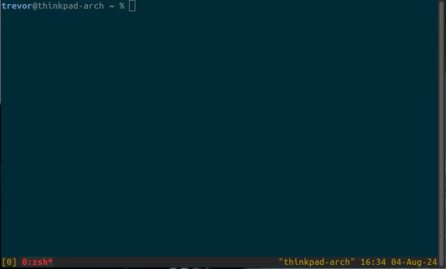

# tmux-notepad

## tmux-notepad is a simple per-window notepad for tmux

To use tmux-notepad, add the following to your tmux.conf file.

```
bind N display-popup -E /path/to/tmux-notepad/tmux-notepad.sh
```

This will cause the tmux-notepad window to be opened when you press tmux prefix followed by N

By default, tmux prefix is ^B



## Options

Options can be passed into tmux-notepad by modifying the display-popup command in tmux. Options can be specified like `-e INITIALIZE_TMUX_WINDOW_TITLE=YES ...`.

| Option | Description | Default |
| ------ | ----------- | ------- |
| `INITIALIZE_TMUX_WINDOW_TITLE` | On creation, initialize the note with the title of the tmux window for which the note is being created | `False` if unset |

## License

This software is licensed under the [MIT license](https://opensource.org/license/mit)
